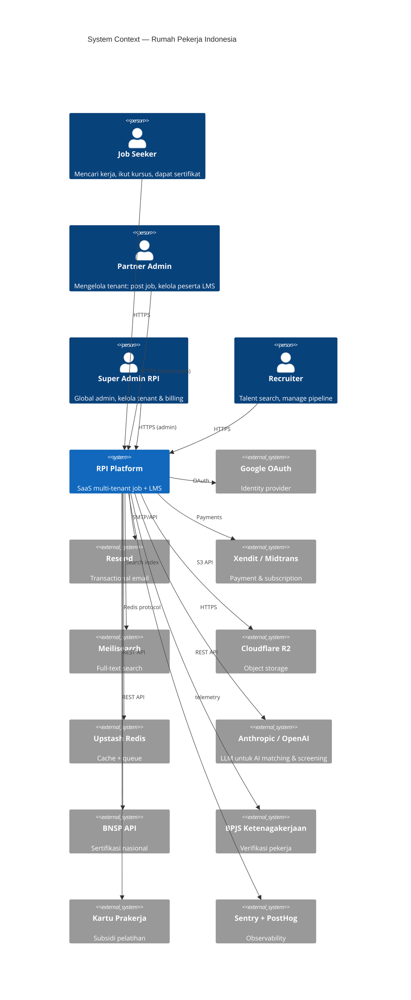

# ARCHITECTURE — Rumah Pekerja Indonesia (RPI)

> Arsitektur sistem SaaS multi-tenant untuk platform job seeker + LMS terintegrasi.

**Versi:** 1.0 — Mei 2026
**Pemilik dokumen:** Engineering
**Pendekatan:** C4 Model (Context, Container, Component, Code)

---

## 1. Prinsip Arsitektur

1. **Multi-tenant by default** — `tenant_id` propagasi di setiap query, enforced via Postgres Row-Level Security (RLS).
2. **Server-first rendering** — Next.js App Router + React Server Components (RSC), minimal client JS.
3. **Type safety end-to-end** — TypeScript strict, Prisma client types, Zod runtime validation.
4. **Edge-friendly** — middleware di Edge runtime, public reads ISR/cached, mutations di Node runtime.
5. **Observable** — OpenTelemetry traces, Sentry errors, PostHog product analytics.
6. **Stateless app servers** — semua state di Postgres/Redis/object store, free scaling horizontal.
7. **Async by default** untuk heavy work (email, AI scoring, video processing) via BullMQ.
8. **Defense in depth** — RLS + application-layer check + audit log; jangan percaya satu lapis.

---

## 2. C4 — Level 1: System Context



---

## 3. C4 — Level 2: Container

```
+----------------------------------------------------------------------------+
|                          CLIENT (Browser / PWA)                            |
|              Next.js App Router — RSC + Client Islands                     |
+----------------------------------------------------------------------------+
                                  |
                                  | HTTPS
                                  v
+----------------------------------------------------------------------------+
|                          CDN / Edge (Vercel)                               |
|     Static assets, ISR cache, Edge Middleware (tenant resolution)         |
+----------------------------------------------------------------------------+
                                  |
                                  v
+----------------------------------------------------------------------------+
|                  Next.js Server (Node 20 runtime)                          |
|   - Route Handlers (REST)                                                  |
|   - Server Actions                                                         |
|   - RSC fetch + DB access                                                  |
|   - NextAuth (Auth.js v5)                                                  |
+----------------------------------------------------------------------------+
        |              |             |            |              |
        v              v             v            v              v
  +-----------+  +---------+  +----------+  +---------+  +--------------+
  | Postgres  |  | Redis   |  | Meili    |  | R2/S3   |  | BullMQ       |
  | (Neon)    |  | Upstash |  | search   |  | storage |  | worker (Node)|
  | + RLS     |  | cache   |  |          |  |         |  | (Render)     |
  +-----------+  +---------+  +----------+  +---------+  +--------------+
                                                                |
                                                                v
                                                       +----------------+
                                                       | LLM API        |
                                                       | (Anthropic)    |
                                                       +----------------+
```

### Container Responsibilities

| Container | Tech | Tugas |
|---|---|---|
| **Web App** | Next.js 14 App Router, TypeScript, Tailwind, Atomic Design | UI rendering, route handlers, server actions |
| **Edge Middleware** | Next.js Middleware (Edge Runtime) | Resolve tenant dari subdomain, geo-redirect, rate-limit cepat |
| **DB Primary** | PostgreSQL 15 (Neon serverless) | Source of truth, RLS, transactions |
| **DB Replica** | Postgres read-replica | Read-heavy queries (job board public) |
| **Cache** | Upstash Redis (serverless) | Session cache, hot keys, rate-limit counters |
| **Search** | Meilisearch Cloud | Job + course + profile full-text |
| **Object Storage** | Cloudflare R2 (S3-compatible) | CV PDF, course video, logo tenant, attachments |
| **Queue / Workers** | BullMQ + Redis | Email, AI scoring, video transcoding, indexing |
| **CDN** | Vercel Edge + Cloudflare | Static + image optimization |
| **Auth** | NextAuth v5 (Auth.js) | Credentials + Google OAuth |
| **Payments** | Xendit (primary), Midtrans (fallback) | Subscription, one-time payment |
| **LLM** | Anthropic Claude (primary), OpenAI (fallback) | CV review, matching, screening, course Q&A |
| **Observability** | OpenTelemetry → Sentry + Axiom logs + PostHog | Tracing, errors, analytics |

---

## 4. C4 — Level 3: Component (Web App Internal)

```
Next.js App
+----------------------------------------------------------+
|  app/                                                    |
|    (marketing)/                  RSC, ISR                |
|    (auth)/login, register        client                  |
|    (app)/                        protected, dynamic      |
|      jobs/                                               |
|      learn/                                              |
|      profile/                                            |
|      partner/dashboard           per-tenant              |
|      admin/                      superadmin only         |
|    api/v1/...                    REST                    |
|                                                          |
|  components/                                             |
|    atoms/   Button, Input, Badge, ...                    |
|    molecules/ JobCard, CourseCard, Pagination            |
|    organisms/ JobList, CourseGrid, Navbar                |
|    templates/ MarketingLayout, AppLayout                 |
|                                                          |
|  lib/                                                    |
|    auth/         next-auth config, session helpers       |
|    db/           prisma client, tenant context           |
|    tenant/       resolveTenant(host)                     |
|    cache/        Redis wrapper, React cache              |
|    queue/        BullMQ helpers                          |
|    search/       Meilisearch client                      |
|    storage/      R2 presigned URLs                       |
|    llm/          Claude client + prompt cache            |
|    rbac/         can(user, action, resource)             |
|    audit/        write audit log                         |
|                                                          |
|  prisma/                                                 |
|    schema.prisma                                         |
|    migrations/                                           |
|    seed.ts                                               |
+----------------------------------------------------------+
```

---

## 5. Multi-Tenant Architecture

### 5.1 Strategi: Shared DB + Tenant ID + RLS

| Strategi | Pro | Con | Pilihan RPI |
|---|---|---|---|
| Database per tenant | isolasi kuat | mahal, ops complex | NO |
| Schema per tenant | medium isolation | migration nightmare | NO |
| **Shared DB + tenant_id + RLS** | cost-effective, scalable, kuat dgn RLS | extra disiplin di kode | **YES** |

### 5.2 Tenant Resolution Flow

```mermaid
sequenceDiagram
  participant U as User Browser
  participant E as Edge Middleware
  participant W as Web Server
  participant DB as Postgres
  U->>E: GET https://telkom.rumahpekerja.id/jobs
  E->>E: Parse host → subdomain "telkom"
  E->>DB: SELECT id, settings FROM tenants WHERE slug='telkom' (cached Redis)
  E->>W: rewrite + headers x-tenant-id, x-tenant-slug
  W->>W: getTenantFromHeaders() → store in AsyncLocalStorage
  W->>DB: SET app.tenant_id = $1; SELECT ... FROM jobs;
  DB-->>W: rows (RLS-filtered)
  W-->>U: HTML
```

### 5.3 Middleware (Edge)

```ts
// middleware.ts
import { NextResponse } from 'next/server';
import type { NextRequest } from 'next/server';
import { getTenantBySlugCached } from '@/lib/tenant/edge-cache';

export async function middleware(req: NextRequest) {
  const host = req.headers.get('host') ?? '';
  const sub = host.split('.')[0];
  const isApex = sub === 'rumahpekerja' || sub === 'www' || sub === 'localhost:3000';

  if (isApex) {
    const res = NextResponse.next();
    res.headers.set('x-tenant-id', 'public');
    return res;
  }

  const tenant = await getTenantBySlugCached(sub);
  if (!tenant) return NextResponse.rewrite(new URL('/tenant-not-found', req.url));

  const res = NextResponse.next();
  res.headers.set('x-tenant-id', tenant.id);
  res.headers.set('x-tenant-slug', tenant.slug);
  return res;
}

export const config = { matcher: ['/((?!_next/static|_next/image|favicon.ico).*)'] };
```

### 5.4 Prisma + RLS

```sql
-- migrations: enable RLS
ALTER TABLE jobs ENABLE ROW LEVEL SECURITY;

CREATE POLICY tenant_isolation_jobs ON jobs
  USING (tenant_id = current_setting('app.tenant_id')::uuid);

CREATE POLICY tenant_insert_jobs ON jobs
  FOR INSERT WITH CHECK (tenant_id = current_setting('app.tenant_id')::uuid);
```

```ts
// lib/db/prisma.ts
import { PrismaClient } from '@prisma/client';
import { tenantContext } from '@/lib/tenant/context';

export const prisma = new PrismaClient().$extends({
  query: {
    $allOperations: async ({ args, query }) => {
      const tenantId = tenantContext.getStore()?.tenantId;
      if (tenantId) {
        await prisma.$executeRawUnsafe(`SET LOCAL app.tenant_id = '${tenantId}'`);
      }
      return query(args);
    },
  },
});
```

### 5.5 Session Augmentation

```ts
// lib/auth/config.ts
callbacks: {
  async jwt({ token, user }) {
    if (user) {
      token.userId = user.id;
      token.role = user.role;          // superadmin | admin | partner | user
      token.tenantId = user.tenantId;  // null untuk superadmin global
    }
    return token;
  },
  async session({ session, token }) {
    session.user.id = token.userId;
    session.user.role = token.role;
    session.user.tenantId = token.tenantId;
    return session;
  },
}
```

Authorization check (RBAC):

```ts
// lib/rbac/can.ts
export function can(user: SessionUser, action: Action, resource: Resource): boolean {
  if (user.role === 'superadmin') return true;
  if (user.tenantId !== resource.tenantId) return false;
  // ...granular checks
}
```

---

## 6. Data Flow — Request Lifecycle

### 6.1 Public Job Listing (cached)

```
Browser → Edge → ISR cache HIT? → return HTML (TTFB ~50ms)
                       ↓ MISS
                   Node server → fetch jobs (Prisma) → render RSC → cache
```

### 6.2 Authenticated Job Apply (mutation)

```
Browser → Edge middleware (verify session JWT) → Server Action
   → tenantContext.run({ tenantId, userId }, async () => {
       transactional: insert Application, increment counter
       queue: send-email, score-ai
     })
   → revalidatePath('/jobs/[id]')
   → return result
```

### 6.3 LMS Video Streaming

```
Browser → request /api/v1/courses/[id]/video → presigned R2 URL (5min)
        → stream HLS chunks from R2 via Cloudflare CDN
        → emit `video.progress` event to PostHog
```

---

## 7. Caching Strategy

| Layer | Tech | TTL | Invalidate Trigger |
|---|---|---|---|
| Browser HTTP | `Cache-Control` | 60s public, 0 private | header |
| CDN edge | Vercel + Cloudflare | hours | `revalidateTag` |
| Next.js segment cache | App Router | per-segment | `revalidatePath`, `revalidateTag` |
| React `cache()` | per-request memoization | request scope | n/a |
| Redis (Upstash) | tenant info, hot job, search facets | 60-3600s | publish on update |
| ISR | Next.js | per-page revalidate | `revalidate` export or webhook |
| Database query plan | Postgres | session | analyze |

### Tag-based Invalidation

```ts
// Read with tag
const jobs = await unstable_cache(
  () => prisma.job.findMany({ where: { tenantId } }),
  ['jobs', tenantId],
  { tags: [`tenant:${tenantId}:jobs`] }
)();

// Invalidate on write
revalidateTag(`tenant:${tenantId}:jobs`);
```

---

## 8. Async Processing (BullMQ)

### 8.1 Queues

| Queue | Worker Concurrency | Retry | Pekerjaan |
|---|---|---|---|
| `email` | 20 | 3, exp backoff | transactional email via Resend |
| `ai-cv-review` | 5 | 2 | LLM CV scoring |
| `ai-match` | 10 | 2 | embed + similarity rank |
| `index-search` | 5 | 3 | sync ke Meilisearch |
| `video-transcode` | 2 | 1 | HLS dengan ffmpeg |
| `webhook-out` | 10 | 5 | partner outbound webhook |
| `audit-log` | 50 | 5 | bulk insert audit log |

### 8.2 Worker Deployment

- Deployed terpisah ke **Render** (always-on Node service) atau Railway.
- Shared `lib/queue` package, BullMQ + ioredis connect ke Upstash.
- Graceful shutdown, idempotent job handlers.

```ts
// workers/ai-cv-review.ts
import { Worker } from 'bullmq';
import { reviewCV } from '@/lib/ai/cv-review';

new Worker('ai-cv-review', async (job) => {
  const { applicationId, tenantId } = job.data;
  await tenantContext.run({ tenantId }, () => reviewCV(applicationId));
}, { connection, concurrency: 5 });
```

---

## 9. Search — Postgres FTS → Meilisearch

**MVP (Phase 1-2):** Postgres `tsvector` + GIN index — cukup untuk <100k jobs.

```sql
ALTER TABLE jobs ADD COLUMN search tsvector
  GENERATED ALWAYS AS (
    setweight(to_tsvector('indonesian', coalesce(title, '')), 'A') ||
    setweight(to_tsvector('indonesian', coalesce(description, '')), 'B')
  ) STORED;

CREATE INDEX jobs_search_idx ON jobs USING GIN (search);
```

**Scale (Phase 3+):** Meilisearch — typo tolerance, faceting, geo, multi-tenant via `tenantId` filter.

```ts
const idx = meili.index('jobs');
await idx.search(q, {
  filter: `tenantId = "${tenantId}" AND status = "published"`,
  facets: ['category', 'location', 'salaryRange', 'workType'],
});
```

---

## 10. File Storage (Cloudflare R2 / S3)

- Bucket structure: `r2://rpi-{env}/{tenantId}/{kind}/{uuid}.{ext}`
- Kind: `cv`, `logo`, `course-video`, `course-thumb`, `attachment`.
- Upload via presigned PUT URL (server issues, browser uploads directly).
- Public bucket untuk logo/thumb; private untuk CV/video — signed URL TTL 5-15 menit.
- Virus scan async via ClamAV worker (queue `file-scan`).

```ts
const url = await s3.getSignedUrl(
  new PutObjectCommand({ Bucket, Key: `${tenantId}/cv/${uuid}.pdf` }),
  { expiresIn: 300 }
);
```

---

## 11. Observability

### 11.1 Stack
- **Tracing:** OpenTelemetry SDK → OTLP → Tempo/Honeycomb (atau Vercel OTel).
- **Errors:** Sentry (server + browser), source maps upload.
- **Logs:** Axiom (or Better Stack) — structured JSON, tenant_id sebagai field.
- **Product analytics:** PostHog (self-host or cloud) — events: `job_view`, `apply_submit`, `course_complete`.
- **Uptime:** Better Uptime / Vercel Monitoring.
- **DB:** Neon dashboard + pg_stat_statements; slow query alert via Slack.

### 11.2 Sample SLO

| Service | Target |
|---|---|
| Public web availability | 99.9% / quarter |
| Auth endpoint p95 latency | <200ms |
| Job search p95 latency | <400ms |
| Server action p95 latency | <500ms |
| Error rate | <0.5% |

### 11.3 Instrumentation Wajib
- `tenant_id`, `user_id`, `request_id` di setiap log/trace.
- Custom span untuk DB query, LLM call, external API.
- PostHog event dengan property `tenant_slug`.

---

## 12. Security

- **Auth:** NextAuth v5, JWT session, rotate secret tiap 90 hari, 2FA via TOTP (Phase 2).
- **CSRF:** built-in via Next Server Actions (origin check).
- **XSS:** strict CSP, sanitize user HTML via DOMPurify server-side.
- **SQL injection:** Prisma parameterized; raw SQL hanya via `$executeRaw` tagged template.
- **RLS:** double-check di app layer (defense in depth).
- **Rate limit:** Upstash Ratelimit di middleware untuk `/api/*` & `/login`.
- **Secrets:** Vercel env vars, rotate quarterly, no `.env` di repo.
- **Audit log:** every mutation pada resource sensitive (job, application, settings) → `audit_log` table.
- **PII encryption:** NIK & phone di-encrypt at-rest dengan KMS (libsodium / AES-GCM).
- **Pentest:** annual third-party.
- **Compliance:** UU PDP Indonesia, data residency Jakarta (Neon region ap-southeast-1).

---

## 13. Deployment & Infrastructure

```
+--------------------+
| Cloudflare         |  DNS + WAF + CDN (image)
+--------------------+
         |
         v
+--------------------+
| Vercel             |  Next.js (Web + Edge)
| Regions: sin1, hnd |
+--------------------+
         |
         v
+--------------------+  +-------------+  +-------------+
| Neon Postgres      |  | Upstash     |  | Meilisearch |
| ap-southeast-1     |  | Redis (sin) |  | Cloud sin   |
+--------------------+  +-------------+  +-------------+
         |
         v
+--------------------+  +-------------+
| Render Workers     |  | R2 storage  |
| (BullMQ)           |  | Cloudflare  |
+--------------------+  +-------------+
```

### Environments
- `local` — Docker Compose Postgres + Redis
- `preview` — Vercel preview per PR + Neon branch (auto)
- `staging` — staging.rumahpekerja.id, full stack mirror
- `production` — apex domain & subdomain tenants

### CI/CD
- GitHub Actions: lint, typecheck, test, build, prisma migrate check
- Vercel auto-deploy on push to `main`
- Migration run via `prisma migrate deploy` in pre-deploy script
- Feature flags via PostHog flags (kill-switch)

---

## 14. Scaling Considerations

### 14.1 Read Scaling
- Public job list & detail = ISR-cached (1-5 min revalidate)
- Read replica Postgres untuk heavy analytics queries
- Materialized view untuk dashboard partner

### 14.2 Write Scaling
- Mutation paths instrument; partition `applications` & `audit_log` by `created_at` (monthly) ketika >10M rows
- Async fan-out via BullMQ (email, AI, index)

### 14.3 Tenant Scaling
- 1-1000 tenants single DB OK
- >1000 tenant: pertimbangkan sharding by tenant hash (Citus / read-replica per shard)

### 14.4 LLM Cost
- Prompt caching (Anthropic) untuk system prompt & rubric (>90% hit rate target)
- Embedding cache (vector DB) — don't re-embed JD/CV unchanged
- Tiered model: Haiku untuk classification, Sonnet untuk scoring, Opus untuk executive review

---

## 15. Disaster Recovery

| Asset | RPO | RTO | Strategi |
|---|---|---|---|
| Postgres | 5 menit | 1 jam | Neon point-in-time restore (7 hari), daily logical backup ke R2 (30 hari retention) |
| R2 storage | 1 jam | 4 jam | Versioning enabled, cross-region replication ke region kedua |
| Redis | n/a (cache) | 5 menit | Cold-warm dari DB on restart |
| Meilisearch | 1 jam | 2 jam | Daily snapshot ke R2; reindex on-demand from Postgres |
| Secrets | n/a | 30 menit | 1Password vault + Vercel env backup |

**Runbook:** `docs/runbooks/disaster-recovery.md` (akan dibuat tim Ops).

**Drills:** quarterly DR test (restore staging dari backup, verifikasi data integrity).

---

## 16. Cost Model

### Asumsi
- 10k MAU = ~50k page views/day, 5k authenticated sessions/day, 500 applications/day
- 100k MAU = ~500k page views/day, 50k auth sessions, 5k applications
- 1M MAU = ~5M page views/day, 500k auth sessions, 50k applications

### Estimasi Bulanan (USD)

| Komponen | 10k MAU | 100k MAU | 1M MAU |
|---|---:|---:|---:|
| Vercel (Pro / Enterprise) | $20 | $250 | $2,000 |
| Neon Postgres | $19 | $200 | $1,500 |
| Upstash Redis | $10 | $80 | $500 |
| Meilisearch Cloud | $0 (Postgres FTS) | $90 | $700 |
| R2 storage + egress | $5 | $50 | $400 |
| Render workers | $25 | $150 | $800 |
| Sentry | $26 | $80 | $400 |
| PostHog | $0 (free tier) | $50 | $450 |
| Resend email | $20 | $100 | $600 |
| LLM (Anthropic) | $50 | $500 | $4,000 |
| Domain + Cloudflare | $20 | $20 | $200 |
| **Total infra** | **~$195** | **~$1,570** | **~$11,550** |
| Per MAU | $0.020 | $0.016 | $0.012 |

**Catatan:** biaya turun per-MAU karena prompt cache, ISR, dan economies of scale.

---

## 17. Roadmap Arsitektur

- **Phase 1 (MVP):** Single region (sin1), single DB, no replica, Postgres FTS, no Meilisearch.
- **Phase 2 (v1.0):** Tambah Meilisearch, BullMQ workers di Render, R2 untuk video, Sentry+PostHog.
- **Phase 3 (v1.5):** Read replica DB, vector DB untuk AI matching (pgvector di Neon), Prompt cache Anthropic.
- **Phase 4 (v2.0):** Multi-region (hnd1 tambah), tenant sharding strategy, native mobile gateway BFF.

---

## 18. ADR (Architecture Decision Records)

Pendekatan ADR ringan, file di `docs/adr/NNNN-title.md`. ADR awal:

1. **ADR-0001** — Pilih Next.js App Router daripada Pages Router (RSC, streaming, layout).
2. **ADR-0002** — Multi-tenant shared DB + RLS daripada DB-per-tenant.
3. **ADR-0003** — Prisma daripada Drizzle (mature, RLS-friendly via raw).
4. **ADR-0004** — Atomic Design untuk component hierarchy.
5. **ADR-0005** — BullMQ + Redis untuk queue, bukan SQS (consistency dgn stack).
6. **ADR-0006** — Meilisearch daripada Elasticsearch (cost & DX di Phase 2).
7. **ADR-0007** — Vercel + Neon daripada self-host (speed-to-market).

> Setiap ADR baru harus melalui review minimal 2 engineer + tech-lead approval.

---

## 19. Open Questions / Tech Debt Backlog

- [ ] Strategi feature-flag granular per-tenant (PostHog vs Unleash)
- [ ] Vector DB: pgvector vs dedicated (Pinecone/Qdrant)
- [ ] Strategi i18n untuk konten user-generated
- [ ] Background image optimization (Next/Image vs Cloudflare Images)
- [ ] Mobile app: React Native (Expo) vs PWA-first?
- [ ] Real-time (WebSocket) untuk chat recruiter-candidate — pakai Pusher/Ably?

---

Dokumen ini adalah living document. Setiap arsitek/staff engineer wajib mengupdate ketika ada perubahan struktural signifikan.
