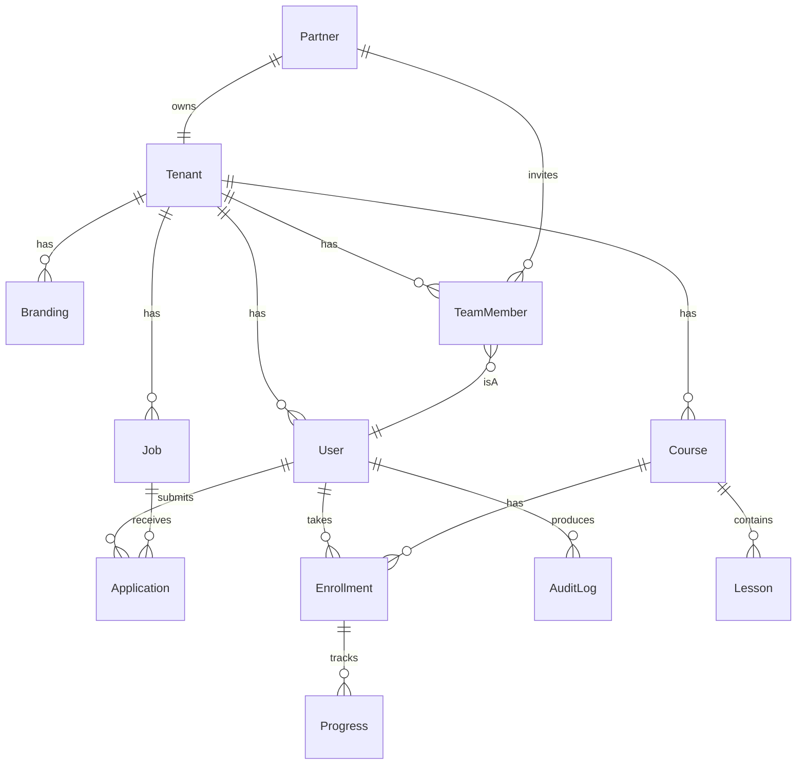

# BACKEND.md — SSN Pekerja (SSN)

Dokumen arsitektur backend untuk platform SaaS SSN. Stack: Next.js 14 App Router (TS), Prisma, PostgreSQL dengan Row Level Security (RLS), NextAuth, BullMQ, Redis (Upstash), S3/R2.

---

## 1. Arsitektur Tingkat Tinggi

```
┌────────────────────────────────────────────────────────────────┐
│  Edge: Vercel Middleware (extract subdomain → x-tenant-slug)   │
└─────────────────────────────┬──────────────────────────────────┘
                              │
        ┌─────────────────────┼─────────────────────┐
        ▼                     ▼                     ▼
┌──────────────┐     ┌────────────────┐    ┌────────────────┐
│ Server Comp. │     │ Route Handlers │    │ Server Actions │
│ (RSC, read)  │     │ /api/*  (REST) │    │ ("use server") │
└──────┬───────┘     └────────┬───────┘    └────────┬───────┘
       │                      │                     │
       └──────────────────────┼─────────────────────┘
                              ▼
                    ┌──────────────────┐
                    │  Service Layer   │ (lib/services/*)
                    │  - Zod validate  │
                    │  - Authz check   │
                    │  - Tx orchestr.  │
                    └────────┬─────────┘
                             │
        ┌────────────────────┼─────────────────────┐
        ▼                    ▼                     ▼
   ┌─────────┐         ┌─────────┐          ┌──────────┐
   │ Prisma  │         │ Redis   │          │ BullMQ   │
   │ +  RLS  │         │ cache   │          │ workers  │
   └────┬────┘         └─────────┘          └─────┬────┘
        ▼                                         ▼
  ┌──────────┐                              ┌──────────┐
  │ Postgres │                              │ S3 / R2  │
  └──────────┘                              └──────────┘
```

Prinsip:

- **Server-first**: data fetching di RSC; mutation via Server Actions atau Route Handlers untuk klien eksternal.
- **REST untuk integrasi eksternal**: `/api/v1/...` untuk webhook, mobile, partner API.
- **Server Actions untuk UI mutation**: type-safe, progressive enhancement.
- **Service layer**: setiap resource punya `lib/services/<resource>.ts` — single source of truth.
- **RLS sebagai pertahanan terakhir**: walaupun service salah, RLS menolak query lintas-tenant.

---

## 2. Tenant Context Flow

### 2.1 Resolusi Subdomain

```ts
// middleware.ts
import { NextResponse, NextRequest } from 'next/server'

const ROOT_DOMAIN = process.env.ROOT_DOMAIN || 'ssn.id'
const RESERVED = new Set(['www', 'app', 'admin', 'api', 'auth'])

export function middleware(req: NextRequest) {
  const host = req.headers.get('host') || ''
  const sub = host.replace(`.${ROOT_DOMAIN}`, '').split(':')[0]
  const res = NextResponse.next()

  if (!sub || sub === ROOT_DOMAIN || RESERVED.has(sub)) {
    res.headers.set('x-tenant-slug', '')
    return res
  }
  res.headers.set('x-tenant-slug', sub)
  return res
}

export const config = { matcher: ['/((?!_next|favicon.ico).*)'] }
```

### 2.2 Server-side Resolution & RLS Binding

```ts
// lib/tenant.ts
import { headers } from 'next/headers'
import { prisma } from '@/lib/db'
import { cache } from 'react'

export const getTenant = cache(async () => {
  const slug = headers().get('x-tenant-slug')
  if (!slug) return null
  return prisma.tenant.findUnique({ where: { slug } })
})

// lib/db.ts — Prisma client with RLS binding per request
import { PrismaClient } from '@prisma/client'
const base = new PrismaClient()

export async function withTenant<T>(
  tenantId: string,
  fn: (tx: PrismaClient) => Promise<T>,
): Promise<T> {
  return base.$transaction(async (tx) => {
    await tx.$executeRawUnsafe(`SELECT set_config('app.current_tenant_id', $1, true)`, tenantId)
    return fn(tx as unknown as PrismaClient)
  })
}
```

Setiap request:

1. Middleware → `x-tenant-slug`.
2. Server resolves slug → tenant row (cached per request).
3. Service membungkus query Prisma dengan `withTenant(tenant.id, ...)`.
4. Transaksi set session var `app.current_tenant_id`.
5. RLS policy memfilter row otomatis.

---

## 3. Data Model

### 3.1 ERD (Mermaid)



### 3.2 Daftar Tabel Inti

| Tabel               | Deskripsi                                       | RLS             |
| ------------------- | ----------------------------------------------- | --------------- |
| `tenants`           | Master tenant, slug unik                        | Bypass (global) |
| `users`             | Akun global; `tenantId` nullable utk superadmin | Yes             |
| `accounts`          | NextAuth OAuth links                            | Yes             |
| `sessions`          | NextAuth session                                | Yes             |
| `branding`          | Logo, warna, copy per tenant                    | Yes             |
| `jobs`              | Lowongan kerja                                  | Yes             |
| `applications`      | Lamaran user ke job                             | Yes             |
| `partners`          | Pemilik tenant (1:1)                            | Yes             |
| `team_members`      | Anggota tim partner                             | Yes             |
| `courses`           | LMS kursus                                      | Yes             |
| `lessons`           | Materi pelajaran                                | Yes             |
| `enrollments`       | User enroll kursus                              | Yes             |
| `progress`          | Progres per lesson                              | Yes             |
| `certificates`      | Sertifikat lulus                                | Yes             |
| `audit_logs`        | Append-only log                                 | Yes             |
| `webhook_endpoints` | URL webhook keluar                              | Yes             |
| `notifications`     | In-app notif                                    | Yes             |

Detail field melihat `prisma/schema.prisma` (file diatur Agent Database).

---

## 4. API Contract

Format: OpenAPI-flavor ringkas. Semua response JSON; error berikut bentuk:

```json
{ "error": { "code": "FORBIDDEN", "message": "...", "details": {} } }
```

Header wajib: `x-tenant-slug` (auto dari subdomain), `Authorization: Bearer <JWT>` untuk klien eksternal.

### 4.1 Auth

#### POST `/api/v1/auth/register`

- Role: public
- Body Zod:

```ts
z.object({
  email: z.string().email(),
  password: z.string().min(12),
  fullName: z.string().min(2).max(80),
  acceptTerms: z.literal(true),
})
```

- Response 201: `{ user: { id, email, fullName }, requiresVerification: true }`
- Errors: 409 `EMAIL_EXISTS`, 400 `WEAK_PASSWORD`, 422 `VALIDATION`
- Contoh:

```bash
curl -X POST https://acme.ssn.id/api/v1/auth/register \
  -H "Content-Type: application/json" \
  -d '{"email":"a@b.id","password":"P@ssword12345","fullName":"Andi","acceptTerms":true}'
```

#### POST `/api/v1/auth/login`

- Role: public; Body `{ email, password }`. Response set cookie sesi + return `{ user, role }`.
- Errors: 401 `INVALID_CREDENTIALS`, 423 `ACCOUNT_LOCKED`, 429 `RATE_LIMITED`.

#### POST `/api/v1/auth/logout`

- Role: authenticated. Invalidasi sesi.

#### POST `/api/v1/auth/verify-email`

- Body `{ token }`. 200 `{ verified: true }`.

#### POST `/api/v1/auth/forgot-password` / `reset-password`

- Token TTL 1 jam, single-use.

### 4.2 Branding

#### GET `/api/v1/branding`

- Role: public (per tenant). Cached `tag:branding:<tenantId>`, revalidate on update.
- Response:

```json
{ "logoUrl": "...", "primary": "#0A2540", "accent": "#C9A961", "tagline": "..." }
```

#### PUT `/api/v1/branding`

- Role: `partner` | `admin`. Body Zod:

```ts
z.object({
  logoUrl: z.string().url().optional(),
  primary: z.string().regex(/^#[0-9A-F]{6}$/i),
  accent: z.string().regex(/^#[0-9A-F]{6}$/i),
  tagline: z.string().max(140).optional(),
})
```

- Memicu `revalidateTag("branding:<tenantId>")`.

### 4.3 Jobs

#### GET `/api/v1/jobs`

- Role: public. Query: `?cursor=&limit=20&q=&loc=&type=`
- Response cursor-based:

```json
{ "items":[...], "nextCursor":"eyJpZCI6..." }
```

#### POST `/api/v1/jobs`

- Role: `partner` | `admin`. Body:

```ts
z.object({
  title: z.string().min(4).max(120),
  description: z.string().min(40).max(20000),
  location: z.string(),
  type: z.enum(['FULL_TIME', 'PART_TIME', 'CONTRACT', 'INTERN']),
  salaryMin: z.number().int().nonnegative().optional(),
  salaryMax: z.number().int().nonnegative().optional(),
  tags: z.array(z.string()).max(10).optional(),
})
```

- Errors: 403 `FORBIDDEN`, 422 `VALIDATION`.

#### GET `/api/v1/jobs/:id` | PATCH | DELETE

- PATCH/DELETE: owner partner atau admin tenant.

#### POST `/api/v1/jobs/:id/apply`

- Role: `user`. Body `{ resumeUrl, coverLetter? }`. Idempotent (`409 ALREADY_APPLIED`).

### 4.4 Users

#### GET `/api/v1/users/me` | PATCH `/api/v1/users/me`

- Role: authenticated.
- PATCH body: subset profile (`fullName`, `phone`, `avatarUrl`, `headline`, `skills[]`).

#### GET `/api/v1/users/me/applications?cursor=`

- Role: `user`. Daftar lamaran.

### 4.5 Partners

#### POST `/api/v1/partners/onboarding`

- Role: authenticated user yang belum punya partner profile.
- Body: `{ companyName, slug, industry, sizeBucket }`. Membuat tenant baru + assign role `partner`.
- Errors: 409 `SLUG_TAKEN`, 403 `ALREADY_PARTNER`.

#### GET `/api/v1/partners/me` | PATCH

### 4.6 Team

#### GET `/api/v1/team`

- Role: `partner` | `admin`. Daftar member tenant.

#### POST `/api/v1/team/invite`

- Body: `{ email, role: "admin"|"recruiter" }`. Email magic-link 7 hari.

#### DELETE `/api/v1/team/:userId`

### 4.7 LMS

#### GET `/api/v1/lms/courses?cursor=` | POST

- POST role: `partner`|`admin`. Body course (lihat 4.10).

#### GET `/api/v1/lms/courses/:id`

- Public read (per tenant). Lessons preview saja jika belum enroll.

#### POST `/api/v1/lms/courses/:id/enroll`

- Role: `user`. Free atau paid (paid panggil payment service — post-MVP).

#### POST `/api/v1/lms/lessons/:id/complete`

- Role: enrolled user. Body `{ score?: number }`. Upsert `Progress`.

#### GET `/api/v1/lms/certificates/:enrollmentId`

- Role: enrolled user. Redirect ke PDF presigned.

### 4.8 Dashboard

#### GET `/api/v1/dashboard/partner`

- Role: `partner`. Aggregat: total jobs, applications 30d, top jobs.

#### GET `/api/v1/dashboard/user`

- Role: `user`. Applications status, kursus aktif, rekomendasi job.

### 4.9 Admin (Superadmin)

| Endpoint                     | Method | Tujuan                      |
| ---------------------------- | ------ | --------------------------- |
| `/api/v1/admin/tenants`      | GET    | List tenant offset paginate |
| `/api/v1/admin/tenants/:id`  | PATCH  | Suspend / verify            |
| `/api/v1/admin/users`        | GET    | Cross-tenant user search    |
| `/api/v1/admin/audit`        | GET    | Audit log filter            |
| `/api/v1/admin/jobs/flagged` | GET    | Moderasi                    |

Semua dilindungi `requireRole("superadmin")`.

### 4.10 Skema Zod (ringkas)

```ts
// lib/validation/job.ts
export const jobCreateSchema = z.object({
  /* see 4.3 */
})
export const jobUpdateSchema = jobCreateSchema.partial()

// lib/validation/course.ts
export const courseCreateSchema = z.object({
  title: z.string().min(4).max(140),
  summary: z.string().max(500),
  level: z.enum(['BEGINNER', 'INTERMEDIATE', 'ADVANCED']),
  priceIdr: z.number().int().nonnegative().default(0),
  lessons: z
    .array(
      z.object({
        title: z.string(),
        contentMd: z.string(),
        videoUrl: z.string().url().optional(),
        order: z.number().int(),
      }),
    )
    .min(1),
})
```

---

## 5. Service Layer Pattern

Setiap service file di `lib/services/<resource>.ts`:

```ts
// lib/services/jobs.ts
import { withTenant } from '@/lib/db'
import { jobCreateSchema } from '@/lib/validation/job'
import { ApiError } from '@/lib/errors'
import { requireRole } from '@/lib/authz'
import { revalidateTag } from 'next/cache'

export async function createJob(input: unknown, ctx: AuthCtx) {
  requireRole(ctx, ['partner', 'admin'])
  const data = jobCreateSchema.parse(input)
  return withTenant(ctx.tenantId, async (tx) => {
    const job = await tx.job.create({
      data: { ...data, tenantId: ctx.tenantId, createdById: ctx.userId },
    })
    await tx.auditLog.create({
      data: { action: 'JOB_CREATE', entityId: job.id, actorId: ctx.userId, tenantId: ctx.tenantId },
    })
    revalidateTag(`jobs:${ctx.tenantId}`)
    return job
  })
}
```

Aturan:

- Service **selalu** terima `ctx: AuthCtx` ({ userId, tenantId, role }).
- Validasi Zod **di service**, bukan di handler.
- Tidak boleh ada SQL/Prisma di Route Handler atau Server Action — handler hanya parsing request + panggil service.
- Audit log dalam transaksi yang sama.

---

## 6. Error Handling

```ts
// lib/errors.ts
export class ApiError extends Error {
  constructor(
    public code: ErrorCode,
    message: string,
    public status: number,
    public details?: Record<string, unknown>,
  ) {
    super(message)
  }
}

export type ErrorCode =
  | 'VALIDATION'
  | 'UNAUTHORIZED'
  | 'FORBIDDEN'
  | 'NOT_FOUND'
  | 'CONFLICT'
  | 'RATE_LIMITED'
  | 'INTERNAL'
  | 'ACCOUNT_LOCKED'
  | 'ALREADY_APPLIED'
  | 'SLUG_TAKEN'
  | 'WEAK_PASSWORD'

export const STATUS_MAP: Record<ErrorCode, number> = {
  VALIDATION: 422,
  UNAUTHORIZED: 401,
  FORBIDDEN: 403,
  NOT_FOUND: 404,
  CONFLICT: 409,
  RATE_LIMITED: 429,
  INTERNAL: 500,
  ACCOUNT_LOCKED: 423,
  ALREADY_APPLIED: 409,
  SLUG_TAKEN: 409,
  WEAK_PASSWORD: 400,
}
```

Wrapper handler:

```ts
// lib/api-handler.ts
export function handler(fn: Handler) {
  return async (req: NextRequest, ctx?: any) => {
    try {
      return NextResponse.json(await fn(req, ctx))
    } catch (e) {
      if (e instanceof ZodError) return errJson('VALIDATION', e.flatten(), 422)
      if (e instanceof ApiError) return errJson(e.code, e.details, e.status, e.message)
      console.error(e)
      return errJson('INTERNAL', undefined, 500, 'Server error')
    }
  }
}
```

---

## 7. Pagination

### 7.1 Cursor (untuk feed publik)

```ts
// lib/pagination.ts
export function encodeCursor(o: object) {
  return Buffer.from(JSON.stringify(o)).toString('base64url')
}
export function decodeCursor<T>(s?: string | null): T | null {
  if (!s) return null
  return JSON.parse(Buffer.from(s, 'base64url').toString())
}

export async function listJobs({ cursor, limit = 20 }: { cursor?: string; limit?: number }) {
  const after = decodeCursor<{ id: string; createdAt: string }>(cursor)
  const rows = await prisma.job.findMany({
    where: after
      ? {
          OR: [
            { createdAt: { lt: new Date(after.createdAt) } },
            { createdAt: new Date(after.createdAt), id: { lt: after.id } },
          ],
        }
      : {},
    orderBy: [{ createdAt: 'desc' }, { id: 'desc' }],
    take: limit + 1,
  })
  const items = rows.slice(0, limit)
  const next = rows.length > limit ? items.at(-1) : null
  return {
    items,
    nextCursor: next ? encodeCursor({ id: next.id, createdAt: next.createdAt }) : null,
  }
}
```

### 7.2 Offset (admin)

- `?page=1&pageSize=50`. Return `{ items, total, page, pageSize }`.
- Hanya untuk endpoint admin/superadmin; tidak untuk endpoint publik (mahal di tabel besar).

---

## 8. Rate Limiting

Upstash Ratelimit + Redis. Per-role config:

```ts
// lib/ratelimit.ts
import { Ratelimit } from '@upstash/ratelimit'
import { Redis } from '@upstash/redis'

const redis = Redis.fromEnv()

export const limiters = {
  anonAuth: new Ratelimit({ redis, limiter: Ratelimit.slidingWindow(5, '10 m') }),
  userRead: new Ratelimit({ redis, limiter: Ratelimit.slidingWindow(120, '1 m') }),
  userWrite: new Ratelimit({ redis, limiter: Ratelimit.slidingWindow(30, '1 m') }),
  partnerWrite: new Ratelimit({ redis, limiter: Ratelimit.slidingWindow(60, '1 m') }),
  admin: new Ratelimit({ redis, limiter: Ratelimit.slidingWindow(300, '1 m') }),
}

export async function rl(name: keyof typeof limiters, key: string) {
  const { success, reset, remaining } = await limiters[name].limit(key)
  if (!success) throw new ApiError('RATE_LIMITED', 'Too many requests', 429, { reset })
  return remaining
}
```

Identifier: `${ip}:${userId ?? "anon"}:${route}`.

---

## 9. Caching Strategy

| Layer   | Tool                    | Use case                   | TTL             |
| ------- | ----------------------- | -------------------------- | --------------- |
| Request | `cache()` React         | Dedup query 1 request      | Per request     |
| Page    | `unstable_cache` + tags | Branding, jobs list        | tag-invalidated |
| Edge    | Vercel Data Cache       | RSC fetch                  | tag-invalidated |
| Redis   | `@upstash/redis`        | Session, rate-limit, queue | bervariasi      |

Contoh:

```ts
import { unstable_cache, revalidateTag } from 'next/cache'

export const getBranding = (tenantId: string) =>
  unstable_cache(
    async () => prisma.branding.findUnique({ where: { tenantId } }),
    ['branding', tenantId],
    { tags: [`branding:${tenantId}`], revalidate: 3600 },
  )()

// after update
revalidateTag(`branding:${tenantId}`)
```

Konvensi tag: `<resource>:<tenantId>[:<id>]`.

---

## 10. File Uploads (Presigned URLs)

R2/S3 — backend hanya menerbitkan presigned URL, klien upload langsung.

```ts
// lib/services/uploads.ts
import { S3Client } from '@aws-sdk/client-s3'
import { createPresignedPost } from '@aws-sdk/s3-presigned-post'

const s3 = new S3Client({ region: 'auto', endpoint: process.env.R2_ENDPOINT! })

const ALLOWED = { resume: ['application/pdf'], avatar: ['image/png', 'image/jpeg', 'image/webp'] }
const MAX = { resume: 5 * 1024 * 1024, avatar: 2 * 1024 * 1024 }

export async function presign(kind: keyof typeof ALLOWED, ctx: AuthCtx, contentType: string) {
  if (!ALLOWED[kind].includes(contentType)) throw new ApiError('VALIDATION', 'mime', 422)
  const key = `${kind}/${ctx.tenantId}/${ctx.userId}/${crypto.randomUUID()}`
  const post = await createPresignedPost(s3, {
    Bucket: process.env.R2_BUCKET!,
    Key: key,
    Conditions: [
      ['content-length-range', 0, MAX[kind]],
      ['eq', '$Content-Type', contentType],
    ],
    Expires: 60,
  })
  return { ...post, key }
}
```

Endpoint: `POST /api/v1/uploads/presign` body `{ kind, contentType }`.

---

## 11. Outbound Webhooks

Partner dapat mendaftarkan endpoint untuk event: `job.created`, `application.received`, `enrollment.completed`.

Skema:

```ts
WebhookEndpoint { id, tenantId, url, secret, events[], active, failures }
WebhookDelivery { id, endpointId, event, payload, status, responseCode, attempt, nextRetryAt }
```

Pengiriman:

- BullMQ job `webhook.deliver`.
- HMAC SHA256 header `X-SSN-Signature: t=<ts>,v1=<sig>`, ts ± 5 menit.
- Retry exponential backoff: 1m, 5m, 30m, 2h, 12h (5 attempts). Setelah gagal, disable endpoint dan notifikasi.

```ts
// signature
import { createHmac } from 'crypto'
const sig = createHmac('sha256', secret).update(`${ts}.${rawBody}`).digest('hex')
```

---

## 12. BullMQ Background Jobs

Worker di proses terpisah (Node, `worker.ts`). Queue:

| Queue                  | Trigger                 | Action                             |
| ---------------------- | ----------------------- | ---------------------------------- |
| `send-email`           | Register, invite, reset | Resend / SES                       |
| `generate-embedding`   | Job/course create       | OpenAI embed → pgvector (post-MVP) |
| `sync-search`          | Job/course mutate       | Update `tsvector` GIN              |
| `generate-certificate` | Enrollment 100%         | PDF + upload R2 + email            |
| `webhook.deliver`      | Internal event          | HTTP POST                          |
| `cleanup-uploads`      | Cron daily              | Delete orphan keys                 |

```ts
// queue example
import { Queue, Worker } from 'bullmq'
const conn = { connection: { url: process.env.REDIS_URL! } }
export const emailQ = new Queue('send-email', conn)

new Worker(
  'send-email',
  async (job) => {
    await sendEmail(job.data)
  },
  { ...conn, concurrency: 10 },
)
```

Konfigurasi: `attempts: 5, backoff: { type: "exponential", delay: 30_000 }`.

---

## 13. LMS Internal API

Modul terpisah `lib/services/lms/*`:

```
lms/courses.ts   # CRUD course, publish flow
lms/lessons.ts   # ordering, content versioning
lms/enroll.ts    # enroll, gating (prereq, payment)
lms/progress.ts  # mark complete, percent calc
lms/cert.ts      # generate, verify by code
```

Konsep kunci:

- **Publish flow**: course `DRAFT` → `REVIEW` (auto-check semua lesson punya content) → `PUBLISHED`.
- **Versioning**: edit lesson di-published-course membuat `LessonRevision`; user dengan enrollment lama tetap lihat versi awal.
- **Certificate code**: `SSN-<tenantSlug>-<crockfordBase32(8)>` → URL publik `/verify/:code`.

Endpoint internal (server-action only):

- `lms.publishCourse(courseId)`
- `lms.reorderLessons(courseId, ids[])`
- `lms.calculatePercent(enrollmentId)` → number

---

## 14. Search (Postgres FTS)

Kolom turunan + index GIN:

```sql
ALTER TABLE jobs ADD COLUMN search_vector tsvector
  GENERATED ALWAYS AS (
    setweight(to_tsvector('indonesian', coalesce(title,'')), 'A') ||
    setweight(to_tsvector('indonesian', coalesce(description,'')), 'B') ||
    setweight(to_tsvector('simple', coalesce(array_to_string(tags,' '),'')), 'C')
  ) STORED;

CREATE INDEX jobs_search_idx ON jobs USING GIN (search_vector);
CREATE INDEX jobs_tenant_search_idx ON jobs (tenant_id) INCLUDE (search_vector);
```

Query:

```sql
SELECT id, title, ts_rank(search_vector, q) AS rank
FROM jobs, websearch_to_tsquery('indonesian', $1) q
WHERE tenant_id = current_setting('app.current_tenant_id')::uuid
  AND search_vector @@ q
ORDER BY rank DESC, created_at DESC
LIMIT 20;
```

Course pakai pola yang sama. Sinkronisasi `tsvector` otomatis via generated column — tidak perlu trigger.

Post-MVP: tambahkan pgvector untuk semantic search; queue `generate-embedding` mengisi kolom `embedding vector(1536)`.

---

## 15. Testing Strategy

| Tipe                 | Tool                                | Lokasi                 | Coverage target        |
| -------------------- | ----------------------------------- | ---------------------- | ---------------------- |
| Unit (service, util) | Vitest                              | `tests/unit/**`        | 80% lines              |
| Integration (DB+RLS) | Vitest + Testcontainers Postgres    | `tests/integration/**` | path-critical          |
| API (HTTP)           | Vitest + supertest + Next test mode | `tests/api/**`         | all endpoints          |
| E2E                  | Playwright                          | `tests/e2e/**`         | smoke + critical flows |
| Load                 | k6                                  | `tests/load/**`        | top 10 endpoints       |

Contoh test isolasi tenant:

```ts
it('user tenant A cannot read tenant B jobs', async () => {
  const a = await seedTenant('a')
  const b = await seedTenant('b')
  await createJob({ title: 'secret' }, ctx(b, 'partner'))
  const list = await listJobs({}, ctx(a, 'user'))
  expect(list.items).toHaveLength(0)
})
```

CI: GitHub Actions matrix (node 20), Postgres service container, run migrations, seed, jalankan suite. Playwright pakai preview deployment.

---

## 16. Observability

- **Logging**: pino (JSON), `requestId`, `tenantId`, `userId`, `route`, `latencyMs`. Ship ke Logtail / Axiom.
- **Metrics**: OpenTelemetry → Grafana Cloud. Histogram per route, queue depth, RLS query time.
- **Tracing**: `@vercel/otel`. Span: middleware → handler → service → prisma → db.
- **Error**: Sentry. Tag `tenantSlug`, `role`. Source maps upload di CI.
- **Health**: `/api/healthz` (liveness), `/api/readyz` (DB + Redis ping). Cron uptime check 1m.

---

## 17. Konfigurasi Lingkungan

| Var                             | Required | Catatan                                |
| ------------------------------- | -------- | -------------------------------------- |
| `DATABASE_URL`                  | yes      | Postgres dengan user app (bukan owner) |
| `DIRECT_URL`                    | yes      | Migrasi                                |
| `NEXTAUTH_SECRET`               | yes      | 32+ byte random                        |
| `NEXTAUTH_URL`                  | yes      | `https://app.ssn.id`                   |
| `GOOGLE_CLIENT_ID/SECRET`       | yes      | OAuth                                  |
| `REDIS_URL`                     | yes      | Upstash                                |
| `R2_ENDPOINT/BUCKET/KEY/SECRET` | yes      | Storage                                |
| `RESEND_API_KEY`                | yes      | Email                                  |
| `SENTRY_DSN`                    | yes      | Errors                                 |
| `ROOT_DOMAIN`                   | yes      | `ssn.id`                               |

Validasi env di `lib/env.ts` (Zod, fail-fast pada boot).

---

## 18. Konvensi Repo Backend

```
app/
  (marketing)/...
  (dashboard)/...
  api/v1/<resource>/route.ts
lib/
  db.ts
  tenant.ts
  authz.ts
  errors.ts
  ratelimit.ts
  pagination.ts
  validation/<resource>.ts
  services/<resource>.ts
  services/lms/...
  queues/<queue>.ts
workers/
  index.ts (boot all workers)
prisma/
  schema.prisma
  migrations/
tests/
  unit/  integration/  api/  e2e/  load/
```

Aturan import: handler tidak boleh import `@/lib/db` langsung — selalu via service.

---

## 19. Migrasi & Deployment

- **Migrasi**: `prisma migrate deploy` jalan di pre-deploy step Vercel via GitHub Action separate (bukan di build).
- **Zero-downtime**: kolom baru selalu nullable dulu; backfill via worker; drop kolom lama di rilis berikut.
- **Feature flag**: `flags.ts` baca dari `tenant.featureFlags` JSONB.
- **Rollback**: tag image, `prisma migrate resolve --rolled-back <name>` jika perlu.

---

## 20. Roadmap Backend

- **MVP**: auth, tenant, branding, jobs, applications, partner onboarding, team, dashboard, audit log.
- **v1.1**: LMS lengkap, sertifikat, search FTS.
- **v1.2**: pgvector recommendations, outbound webhooks GA.
- **v2.0**: marketplace integrasi, public API key, partner billing.
